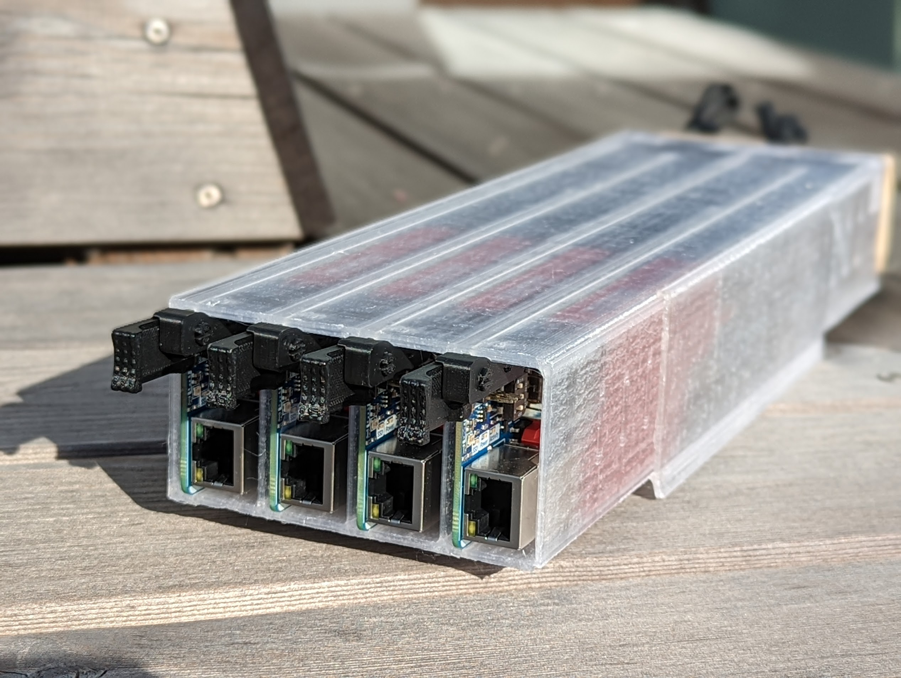

# Preview



# Overview

This repository shows how to configure and install NixOS on a cluster of Compute
Blade boards.

The repository includes:

- Guide on how to install and maintenance NixOS on your Compute Blade nodes.
- Custom installer images for compute module 4/5.
- Host configurations for individual Compute Blade nodes.

It is based on ,
which provides NixOS support for Raspberry Pi Compute Modules.

> [!NOTE]
> This guide expects that you are an experienced NixOS user, it doesn't cover
> how to create flake based configuration.

# Getting Started

This guide explains how to boot a temporary NixOS installer image and then
install the final NixOS system onto the ComputeBlade SSD.

## Prerequisites

- Uptime Compute Blade DEV
- Raspberry Pi Compute Module 4/5
- NVMe SSD
- SD Card, only if your Compute Module doesn't have eMMC
- Network Switch POE+
- Linux machine with Nix

## Build the Installer Image

### Clone the repository

Clone the repository wherever you want to keep your cluster configuration files.
I usually keep mine under `~/.config.`.

```shell
git clone https://github.com/thatwhichisdev/blazing-cluster.git ~/.config/blazing-cluster
```

### Modify the installer configuration

For the best experience, add your public SSH key to the configuration. This
allows you to SSH into the installer and final system without typing a password.

Modify following sections in `/modules/openssh.nix`

```nix
users.users.nixos.openssh.authorizedKeys.keys = [
  "<your public ssh key here>"
];

users.users.root.openssh.authorizedKeys.keys = [
  "<your public ssh key here>"
];
```

You can also add extra tools or settings to the installer image if needed.

Keep in mind that this installer system is not the final system. It is only used
to boot the board and run nixos-anywhere.

### Build the installer image

This repository defines separate installer images for Compute Module 4 and
Compute Module 5.

Run following command to generate installer, replace `<cmX>` with desired target
`cm4` or `cm5`.

```shell
nix --accept-flake-config build .#installerImages.installer-<cmX>
```

After the build finishes, the generated image will be available under
`result/sd-image/nixos-installer-<cmX>.img.zst`

## Flash the Installer Image

### Flash the image to SD card

Use this method only if your Compute Module does not have eMMC.

Connect the SD card to your Linux machine and find its device name using `lsblk`
command. It usually appears as something like `/dev/sdX`. No mounting needed.

Flash the image with following command, replace installer and target devices
with yours:

```shell
zstdcat result/sd-image/nixos-installer-<cmX>.img.zst | sudo dd of=/dev/sdX bs=4M status=progress conv=fsync
```

> [!WARNING]
> Be careful: use the whole disk, for example `/dev/sdX`, not a partition like
> `/dev/sdX1`.

As confirmation that flashing completed successfully you will see metrics in the
console:

```shell
385+1 records in
385+1 records out
1618251606 bytes (1.6 GB, 1.5 GiB) copied, 49.1864 s, 32.9 MB/s
```

### Flash the image onto eMMC

Use this method if your Compute Module has onboard eMMC.

This process requires putting the Compute Module into USB boot mode and flashing
the eMMC from your Linux machine.

First, we need to install official raspberry's `rpiboot` tool to boot our
compute module over USB.

For simplicity, I just install it via `nix-shell`, run following command:

```shell
nix-shell -p rpiboot
```

Now, run `rpiboot` as sudo to start listening for the compute module over USB:

```shell
sudo rpiboot
```

You will see following output

```shell
RPIBOOT: build-date 2026/05/09 pkg-version 20250908~162618~bookworm

Please fit the EMMC_DISABLE / nRPIBOOT jumper before connecting the power and USB cables to the target device.
If the device fails to connect then please see https://rpltd.co/rpiboot for debugging tips.

Waiting for BCM2835/6/7/2711/2712...
```

Move the USB switch on the Compute Blade to the USB Type-C position. Then, while
holding down the nRPIBOOT button on the blade connect the USB Type-C cable. You
will see following:

```shell
Directory not specified - trying default /nix/store/5knggxch09wj8qf7pgx6m19z3ib22b18-rpiboot-20250908-162618-bookworm/share/rpiboot/mass-storage-gadget64/
Sending bootcode.bin
Successful read 4 bytes
Waiting for BCM2835/6/7/2711/2712...

Second stage boot server
File read: mcb.bin
File read: memsys00.bin
File read: memsys01.bin
File read: memsys02.bin
File read: memsys03.bin
File read: memsys04.bin
File read: memsys05.bin
File read: memsys06.bin
File read: memsys07.bin
File read: memsys08.bin
File read: bootmain
Loading: /nix/store/5knggxch09wj8qf7pgx6m19z3ib22b18-rpiboot-20250908-162618-bookworm/share/rpiboot/mass-storage-gadget64//config.txt
File read: config.txt
Loading: /nix/store/5knggxch09wj8qf7pgx6m19z3ib22b18-rpiboot-20250908-162618-bookworm/share/rpiboot/mass-storage-gadget64//boot.img
File read: boot.img
Second stage boot server done
```

If everything finishes successfully, you should be able to see your eMMC via
`lsblk`:

```shell
[nix-shell:~/development/thatwhichisdev/blazing-cluster]$ lsblk
NAME        MAJ:MIN RM   SIZE RO TYPE MOUNTPOINTS
sda           8:0    1   7.3G  0 disk
├─sda1        8:1    1     1G  0 part
└─sda2        8:2    1   6.3G  0 part
```

Flash the image with following command, replace installer and target devices
with yours:

```shell
zstdcat result/sd-image/nixos-installer-<cmX>.img.zst | sudo dd of=/dev/sdX bs=4M status=progress conv=fsync
```

> [!WARNING]
> Be careful: use the whole disk, for example `/dev/sdX`, not a partition like
> `/dev/sdX1`.

As confirmation that flashing completed successfully you will see metrics in the
console:

```shell
385+1 records in
385+1 records out
1618251606 bytes (1.6 GB, 1.5 GiB) copied, 49.1864 s, 32.9 MB/s
```

## Booting Installer Image

After flashing the installer image, power on the board, if you're using SD card
don't forget to insert it.

Once the board boots, find it's IP address on your local network.

You can SSH into the installer with:

```shell
ssh root@<hostname>
```

If you added your SSH key to the installer configuration, key-based login should
work automatically, otherwise you need to connect external display via HDMI
cable and copy the password from the welcome message.

## Install NixOS

After the board has booted into the temporary installer image, install the final
NixOS system with nixos-anywhere.

The final system is installed to the SSD. Disk partitioning and ZFS setup are
handled by disko using the configuration from `/modules/disko.nix`.

To install system run:

```shell
nix run github:nix-community/nixos-anywhere -- --flake .#<system> root@<hostname>
```

Example:

```shell
nix run github:nix-community/nixos-anywhere -- --flake .#cb1 root@192.168.0.161
```

When the installation finishes, you should see following in the console:

```shell
kernel boot files installed for nixos generation '1-default'
removing obsolete generations in /boot/firmware/nixos...
generational bootloader installed
installation finished!
### Rebooting ###
Pseudo-terminal will not be allocated because stdin is not a terminal.
Warning: Permanently added '192.168.0.161' (ED25519) to the list of known hosts.
umount: /mnt/var/lib (rpool/safe/var/lib) unmounted
umount: /mnt/var (rpool/system/var) unmounted
umount: /mnt/nix (rpool/local/nix) unmounted
umount: /mnt/home (rpool/safe/home) unmounted
umount: /mnt/boot/firmware unmounted
umount: /mnt/boot unmounted
umount: /mnt (rpool/system/root) unmounted
### Waiting for the machine to become unreachable due to reboot ###
Warning: Permanently added '192.168.0.161' (ED25519) to the list of known hosts.
Warning: Permanently added '192.168.0.161' (ED25519) to the list of known hosts.
Warning: Permanently added '192.168.0.161' (ED25519) to the list of known hosts.
Warning: Permanently added '192.168.0.161' (ED25519) to the list of known hosts.
Warning: Permanently added '192.168.0.161' (ED25519) to the list of known hosts.
ssh: connect to host 192.168.0.161 port 22: Connection refused
### Done! ###
```

Now, connect via SSH and enjoy!

```shell
ssh nixos@<hostname>
```

# Maintenance

To change configuration of the running system you can simply run:

```shell
nixos-rebuild switch --flake .#<system> --target-host root@<hostname>
```

Otherwise you can clone this repository to the compute blade and run
`nixos-rebuild` directly on it, in my case I'm running Asahi Linux on M1 Mac, so
I have aarch64 on my main machine and building remotely usually is best choice
for me. If you have different architecture on your main machine builds might
take very long time to build, in that case you can indeed try to apply changes
within the blade itself.

# Licensing

The code in this project is licensed under MIT license. Check
[LICENSE](LICENSE.md) for further details.
